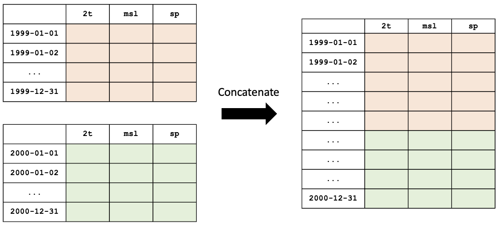

# ecml-tools

A package to hold various functions to support training of ML models on ECMWF data.

## Installation

This package will be a collection of tools, with their own dependencies. In order to not
install unnecessary dependencies, the package is split in parts.

For handling datasets, you will need to install the `data` extra:


```bash
pip install ecml-tools[data]
```

For provenance tracking, you will need to install the `provenance` extra:

```bash
pip install ecml-tools[provenance]
```

To install everything:

```bash
pip install ecml-tools[all]
```

# Datasets

A `dataset` wraps a `zarr` file that follows the format used by ECMWF to train its machine learning models.

```python
from ecml_tools.data import open_dataset

ds = open_dataset("aifs-ea-an-oper-0001-mars-o96-1979-2022-1h-v2")
```

The dataset can be passed as a path or URL to a `zarr` file, or as a name. In the later case, the package will use the entry `zarr_root` of `~/.ecml-tool` file to create the full path or URL:

```yaml
zarr_root: /path_or_url/to/the/zarrs
```

## Attributes of a dataset

As the underlying `zarr`, the `dataset` is an iterable:

```python
from ecml_tools.data import open_dataset

ds = open_dataset("aifs-ea-an-oper-0001-mars-o96-1979-2022-1h-v2")

# Print the number of rows (i.e. dates):

print(len(ds))

# Iterate throw the rows,

for row in ds:
    print(row)

# or access a item directly.

print(row[10])

# You can retrieve the shape of the dataset,

print(ds.shape)

# the list of variables,

print(ds.variables)

# the mapping between variable names and columns index

two_t_index = ds.name_to_index["2t"]
row = ds[10]
print("2t", row[two_t_index])

# Get the list of dates (as NumPy datetime64)

print(ds.dates)

# The number of hours between consecutive dates

print(ds.frequency)

# The resolution of the underlying grid

print(ds.resolution)

# The list of latitudes of the data values (NumPy array)

print(ds.latitudes)

# The same for longitudes

print(ds.longitudes)

# And the statitics

print(ds.statistics)
```

The statistics is a dictionary of NumPy vectors following the order of the variables:

```python
{
    "mean": ...,
    "stdev": ...,
    "minimum": ...,
    "maximum": ...,
}
```

To get the statistics for `2t`:

```python
two_t_index = ds.name_to_index["2t"]
stats = ds.statistics
print("Average 2t", stats["mean"][two_t_index])
```

## Subsetting datasets

You can create a view on the `zarr` file that selects a subset of dates.

### Changing the frequency

```python
from ecml_tools.data import open_dataset

ds = open_dataset("aifs-ea-an-oper-0001-mars-o96-1979-2022-1h-v2",
    freqency="12h")
```

The `frequency` parameter can be a integer (in hours) or a string following with the suffix `h` (hours) or `d` (days).

### Selecting years

You can select ranges of years using the `start` and `end` keywords:

```python
from ecml_tools.data import open_dataset

training = open_dataset("aifs-ea-an-oper-0001-mars-o96-1979-2022-1h-v2",
    start=1979,
    end=2020)

test = open_dataset("aifs-ea-an-oper-0001-mars-o96-1979-2022-1h-v2"
    start=2021,
    end=2022)
```

The selection includes all the dates of the `end` years.

### Selecting more precise ranges

You can select a few months, or even a few days:

```python
from ecml_tools.data import open_dataset

training = open_dataset("aifs-ea-an-oper-0001-mars-o96-1979-2022-1h-v2",
    start=202306,
    end=202308)

test = open_dataset("aifs-ea-an-oper-0001-mars-o96-1979-2022-1h-v2"
    start=20200301,
    end=20200410)
```

The following are equivalent way of describing `start` or `end`:

* `2020` and `"2020"`
* `202306`, `"202306"` and `"2023-06"`
* `20200301`, `"20200301"` and `"2020-03-01"`

You can omit either `start` or `end`. In that case the first and last date of the dataset will be used respectively.

### Combining both

You can combine both subsetting methods:

```python
from ecml_tools.data import open_dataset

training = open_dataset("aifs-ea-an-oper-0001-mars-o96-1979-2022-1h-v2",
    start=1979,
    end=2020,
    frequency="6h")
```

## Combining datasets

You can create a virtual dataset by combining two or more `zarr` files.

```python
from ecml_tools.data import open_dataset

ds = open_dataset(
    "dataset-1",
    "dataset-2",
    "dataset-3",
    ...
)
```

When given a list of `zarr` files, the package will automatically work out if the files can be _concatenated_ or _joined_ by looking at the range of dates covered by each files.

If the dates are different, the files are concatenated. If the dates are the same, the files are joined. See below for more information.

## Concatenating datasets

You can concatenate two or more datasets along the dates dimension. The package will check that all datasets are compatible (same resolution, same variables, etc.). Currently, the datasets must be given in chronological order with no gaps between them.

```python
from ecml_tools.data import open_dataset

ds = open_dataset(
    "aifs-ea-an-oper-0001-mars-o96-1940-1978-1h-v2",
    "aifs-ea-an-oper-0001-mars-o96-1979-2022-1h-v2"
)
```



Please note that you can pass more than two `zarr` files to the function.

> **_NOTE:_** When concatenating file, the statistics are not recomputed; it is the statistics of first file that are returned to the user.

## Joining datasets

You can join two datasets that have the same dates, combining their variables.

```python
from ecml_tools.data import open_dataset

ds = open_dataset(
    "aifs-ea-an-oper-0001-mars-o96-1979-2022-1h-v2",
    "some-extra-parameters-from-another-source-o96-1979-2022-1h-v2",
)
```


If a variable is present in more that one file, that last occurrence of that variable will be used, and will be at the position of the first occurrence of that name.


Please note that you can join more than two `zarr` files.

## Selection, ordering and renaming of variables

You can select a subset of variables when opening a `zarr` file. If you pass a `list`, the variables are ordered according the that list. If you pass a `set`, the order of the file is preserved.

```python
from ecml_tools.data import open_dataset

# Select '2t' and 'tp' in that order

ds = open_dataset(
    "aifs-ea-an-oper-0001-mars-o96-1979-2022-1h-v2",
    select = ["2t", "tp"],
)

# Select '2t' and 'tp', but preserve the order in which they are in the file

ds = open_dataset(
    "aifs-ea-an-oper-0001-mars-o96-1979-2022-1h-v2",
    select = {"2t", "tp"},
)
```

You can also drop some variables:

```python
from ecml_tools.data import open_dataset


ds = open_dataset(
    "aifs-ea-an-oper-0001-mars-o96-1979-2022-1h-v2",
    drop = ["10u", "10v"],
)
```

and reorder them:

```python
from ecml_tools.data import open_dataset

# ... using a list

ds = open_dataset(
    "aifs-ea-an-oper-0001-mars-o96-1979-2022-1h-v2",
    reorder = ["2t", "msl", "sp", "10u", "10v"],
)

# ... or using a dictionnary

ds = open_dataset(
    "aifs-ea-an-oper-0001-mars-o96-1979-2022-1h-v2",
    reorder = {"2t": 0, "msl": 1, "sp": 2, "10u": 3, "10v": 4},
)
```

You can also rename variables:

```python
from ecml_tools.data import open_dataset


ds = open_dataset(
    "aifs-ea-an-oper-0001-mars-o96-1979-2022-1h-v2",
    rename = {"2t": "t2m"},
)
```

This will be useful when your join datasets and do not want variables from one dataset to override the ones from the other.


## Using all options

You can combine all of the above:


```python
from ecml_tools.data import open_dataset

ds = open_dataset(
    "aifs-ea-an-oper-0001-mars-o96-1979-2022-1h-v2",
    "some-extra-parameters-from-another-source-o96-1979-2022-1h-v2",
    start=2000,
    end=2001,
    frequency="12h",
    select={"2t", "2d"},
    ...
)
```

## Building a dataset from a configuration

In practice, you will be building datasets from a configuration file, such as a YAML file:


```python
import yaml
from ecml_tools.data import open_dataset

with open("config.yaml") as f:
    config = yaml.safe_load(f)

training = open_dataset(config["training"])
test = open_dataset(config["test"])
```

This is possible because `open_dataset` can be build from simple lists and dictionaries:

```python
# From a string

ds = open_dataset("aifs-ea-an-oper-0001-mars-o96-1979-2022-1h-v2")

# From a list of strings

ds = open_dataset(
    [
        "aifs-ea-an-oper-0001-mars-o96-1979-2022-1h-v2",
        "aifs-ea-an-oper-0001-mars-o96-2023-2023-1h-v2",
    ]
)


# From a dictionnary

ds = open_dataset(
    {
        "dataset": "aifs-ea-an-oper-0001-mars-o96-1979-2022-1h-v2",
        "frequency": "6h",
    }
)

# From a list of dictionnary

ds = open_dataset(
    [
        {
            "dataset": "aifs-ea-an-oper-0001-mars-o96-1979-2022-1h-v2",
            "frequency": "6h",
        },
        {
            "dataset": "some-extra-parameters-from-another-source-o96-1979-2022-1h-v2",
            "frequency": "6h",
            "select": ["sst", "cape"],
        },
    ]
)

# And even deeper constructs

ds = open_dataset(
    [
        {
            "dataset": "aifs-ea-an-oper-0001-mars-o96-1979-2022-1h-v2",
            "frequency": "6h",
        },
        {
            "dataset": [
                {
                    "dataset": "aifs-od-an-oper-8888-mars-o96-1979-2022-6h-v2",
                    "drop": ["ws"],
                },
                {
                    "dataset": "aifs-od-an-oper-9999-mars-o96-1979-2022-6h-v2",
                    "select": ["ws"],
                },
            ],
            "frequency": "6h",
            "select": ["sst", "cape"],
        },
    ]
)
```
