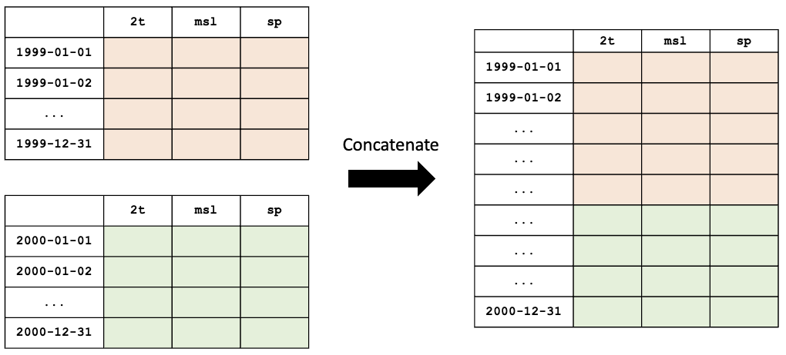
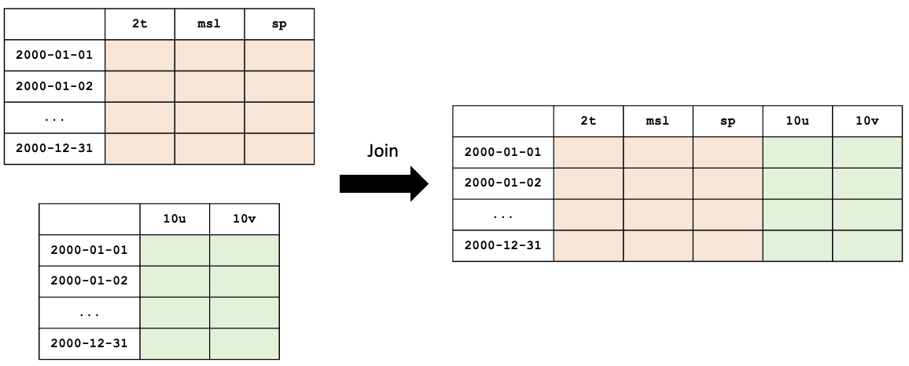

#########
 Options
#########

These are equivalent:

.. code:: python

   ds = open_dataset(path)
   ds = open_dataset(dataset=path)
   ds = open_dataset({"dataset": path})

The last example is useful when the dataset is defined from a
configuration file:

.. code:: python

   with open("config.yaml") as file:
       config = yaml.safe_load(file)

   ds = open_dataset(config)

When defining a dataset from another, you can either use a path or a
dataset:

.. code:: python

   open_dataset(path, statistics=other_path)
   open_dataset(path, statistics=other_dataset)
   open_dataset(path, statistics={"dataset": other_path, "...": ...})

This also applies when combining datasets:

.. code:: python

   open_dataset(ensembles=[dataset1, dataset2, ...])
   open_dataset(ensembles=[path1, path2, ...])
   open_dataset(ensembles=[dataset1, path2, ...])
   open_dataset(
       ensembles=[
           {"dataset": path1, "...": ...},
           {"dataset": path2, "...": ...},
           ...,
       ]
   )

*********
 Options
*********

.. code:: python

   open_dataset(
       dataset,
       start=None,
       end=None,
       frequency=None,
       select=None,
       drop=None,
       reorder=None,
       rename=None,
       statistics=None,
       thinning=None,
       area=None,
       ensembles=None,
       grids=None,
       method=None,
   )

dataset
=======

This is a path or URL to a ``zarr`` file that has been created with this
package, as described in :ref:`datasets-building`.

.. code:: python

   from ecml_tools.data import open_dataset

   ds = open_dataset("aifs-ea-an-oper-0001-mars-o96-1979-2022-1h-v2")
   ds = open_dataset(
       "/path/to/datasets/aifs-ea-an-oper-0001-mars-o96-1979-2022-1h-v2.zarr"
   )
   ds = open_dataset(
       "https://example.com/aifs-ea-an-oper-0001-mars-o96-1979-2022-1h-v2.zarr"
   )
   ds = open_dataset("s3://bucket/aifs-ea-an-oper-0001-mars-o96-1979-2022-1h-v2.zarr")

Alternatively, you can pass an already opened dataset:

.. code:: python

   from ecml_tools.data import open_dataset

   ds1 = open_dataset("aifs-ea-an-oper-0001-mars-o96-1979-2022-1h-v2")
   ds2 = open_dataset(ds1, start=1979, end=2020)

start
=====

This option let you subset the dataset by time. You can pass a date or a

.. code:: python

   open_dataset(dataset, start=1980)

end
===

As for the start option, you can pass a date or a string:

.. code:: python

   open_dataset(dataset, end="2020-12-31")

The following are equivalent way of describing ``start`` or ``end``:

-  ``2020`` and ``"2020"``
-  ``202306``, ``"202306"`` and ``"2023-06"``
-  ``20200301``, ``"20200301"`` and ``"2020-03-01"``

frequency
=========

You can change the frequency of the dataset by passing a string with the

.. code:: python

   ds = open_dataset("aifs-ea-an-oper-0001-mars-o96-1979-2022-1h-v2", frequency="6h")

select
======

.. code:: python

   # Select '2t' and 'tp' in that order

   ds = open_dataset(
       "aifs-ea-an-oper-0001-mars-o96-1979-2022-1h-v2",
       select=["2t", "tp"],
   )

.. code:: python

   # Select '2t' and 'tp', but preserve the order in which they are in the dataset

   ds = open_dataset(
       "aifs-ea-an-oper-0001-mars-o96-1979-2022-1h-v2",
       select={"2t", "tp"},
   )

drop
====

You can also drop some variables:

.. code:: python

   ds = open_dataset(
       "aifs-ea-an-oper-0001-mars-o96-1979-2022-1h-v2",
       drop=["10u", "10v"],
   )

reorder
=======

and reorder them:

... using a list

.. code:: python

   ds = open_dataset(
       "aifs-ea-an-oper-0001-mars-o96-1979-2022-1h-v2",
       reorder=["2t", "msl", "sp", "10u", "10v"],
   )

... or using a dictionary

.. code:: python

   ds = open_dataset(
       "aifs-ea-an-oper-0001-mars-o96-1979-2022-1h-v2",
       reorder={"2t": 0, "msl": 1, "sp": 2, "10u": 3, "10v": 4},
   )

rename
======

You can also rename variables:

.. code:: python

   ds = open_dataset(
       "aifs-ea-an-oper-0001-mars-o96-1979-2022-1h-v2",
       rename={"2t": "t2m"},
   )

This will be useful when your join datasets and do not want variables
from one dataset to override the ones from the other.

.. _statistics:

statistics
==========

.. code:: python

   open_dataset(dataset, statistics=other_dataset)

thinning
========

.. code:: python

   open_dataset(dataset, thinning=..., method="every-nth")

area
====

********************
 Combining datasets
********************

When combining datasets, the statistics of the first dataset are used by
default. You can change this by setting the :ref:`statistics` option to
a different dataset, even if it is not part of the combination. See

concat
======

You can concatenate two or more datasets along the dates dimension. The
package will check that all datasets are compatible (same resolution,
same variables, etc.). Currently, the datasets must be given in
chronological order with no gaps between them.

.. code:: python

   ds = open_dataset(
       "aifs-ea-an-oper-0001-mars-o96-1940-1978-1h-v2",
       "aifs-ea-an-oper-0001-mars-o96-1979-2022-1h-v2",
   )

Please note that you can pass more than two ``zarr`` files to the
function.

   **NOTE:** When concatenating file, the statistics are not recomputed;
   it is the statistics of first file that are returned to the user.

join
====

You can join two datasets that have the same dates, combining their
variables.

.. code:: python

   from ecml_tools.data import open_dataset

   ds = open_dataset(
       "aifs-ea-an-oper-0001-mars-o96-1979-2022-1h-v2",
       "some-extra-parameters-from-another-source-o96-1979-2022-1h-v2",
   )

If a variable is present in more that one file, that last occurrence of
that variable will be used, and will be at the position of the first
occurrence of that name.

.. image:: overlay.png
   :alt: Overlay

Please note that you can join more than two ``zarr`` files.

ensembles
=========

.. code:: python

   open_dataset(ensembles=[dataset1, dataset2, ...])

grids
=====

.. code:: python

   open_dataset(grids=[dataset1, dataset2, ...], method=...)
